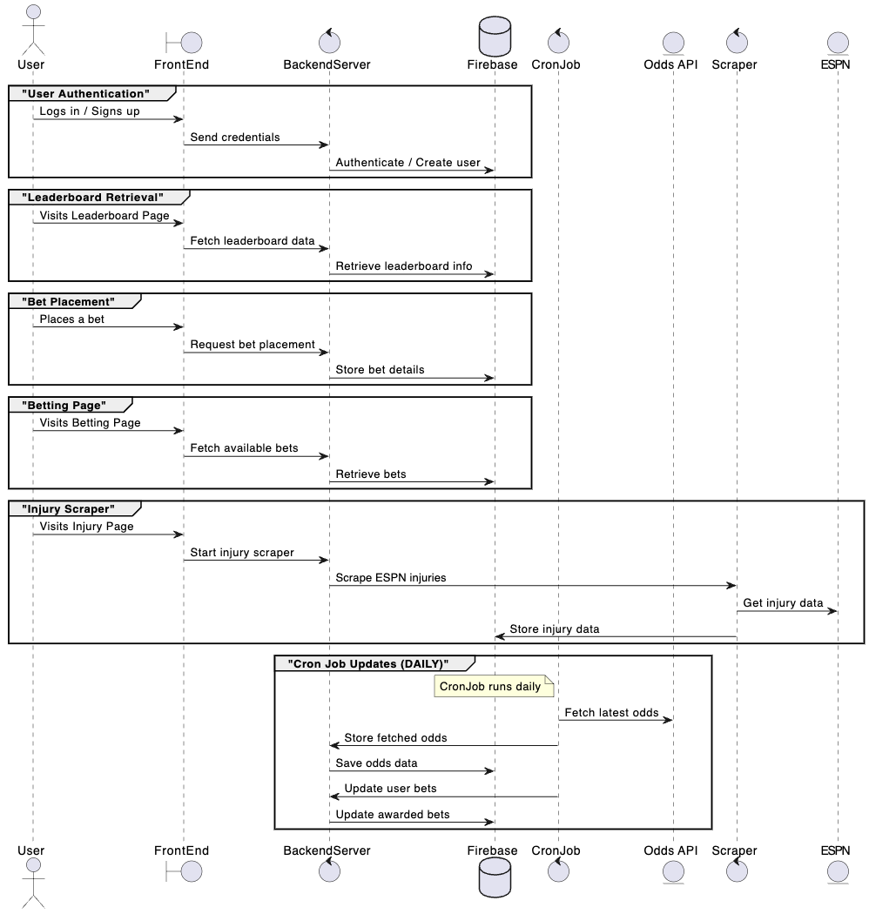

# **Bet Buddies Design Document**

## **1. Overview**
The Bet Buddies system is designed to facilitate user authentication, bet placement, leaderboard retrieval, and injury tracking. The system architecture comprises a frontend built with React, a backend server handling API requests, and Firebase as the primary database. Additionally, a cron job ensures daily updates of betting odds and bet results.

### **System Architecture Diagram**

### **Components Overview**
- **Frontend (React):** Handles user interaction and displays data retrieved from the backend.
- **Backend Server:** Processes API requests and interacts with Firebase for authentication, bet management, leaderboard data, and injury scraping.
- **Firebase:** Stores user data, bets, and leaderboard information.
- **OddsAPI:** Provides up-to-date betting odds.
- **Cron Job:** Periodically updates betting odds and awarded bets.
- **ESPN Scraper:** Fetches injury data for display.

## **2. Software Architecture Design**

### **2.1 User Authentication**  
   This group handles the user login and sign-up process. The user provides credentials, which are sent to the backend server for authentication. If the user doesn't exist, a new account is created in Firebase.

### **2.2 Leaderboard Retrieval**  
   When the user visits the leaderboard page, the frontend sends a request to the backend server to retrieve leaderboard data from Firebase and display it to the user.

### **2.3 Bet Placement**  
   The user places a bet through the frontend, which sends a request to the backend server to store the bet details in Firebase for tracking purposes.

### **2.4 Betting Page**  
   When the user visits the betting page, the frontend fetches the available bets from Firebase through the backend server to display them for the user to select from.

### **2.5 Injury Scraper**  
   When the user visits the injury page, the frontend triggers the injury scraper. The backend scrapes ESPN for injury data, which is then stored in Firebase.

### **2.6 Cron Job Updates (DAILY)**  
   This group represents the **CronJob**, which runs daily. It fetches the latest odds from the **OddsAPI**, stores them in Firebase, and updates user bets. It also ensures that the awarded bets are updated daily.

## **3. Design Process Documentation**
Our design process involved multiple team discussions documented in our GitHub repository. Below are key decisions made:
- **Authentication Mechanism:** Decided to use Firebase for user authentication due to its ease of integration and security.
- **Data Storage:** Chose Firebase as the primary database due to its real-time sync capabilities.
- **Scraping Injuries:** Decided to scrape ESPN because it provides reliable and up-to-date injury reports.
- **Automating Bet Updates:** Implemented a daily cron job to fetch and update odds automatically.

## **4.2 UX Considerations**
### **High-Level User Flow**
1. **User Authentication:**
   - The user signs up or logs in to access the platform.
   - If new, they create an account; otherwise, they proceed to the dashboard.

2. **Placing a Bet:**
   - The user navigates to the **Betting Page**.
   - They browse available bets and select an option.
   - They enter their wager amount and confirm the bet.

3. **Checking Leaderboard:**
   - The user visits the **Leaderboard Page** to view rankings and performance.
   - They compare their standings with others.

4. **Viewing Injury Reports:**
   - The user accesses the **Injury Page** for player updates.
   - The system scrapes and displays real-time injury reports.

5. **Daily Updates (Automated):**
   - A **cron job** fetches the latest odds and updates ongoing bets.
   - The leaderboard and user bets are refreshed accordingly.
